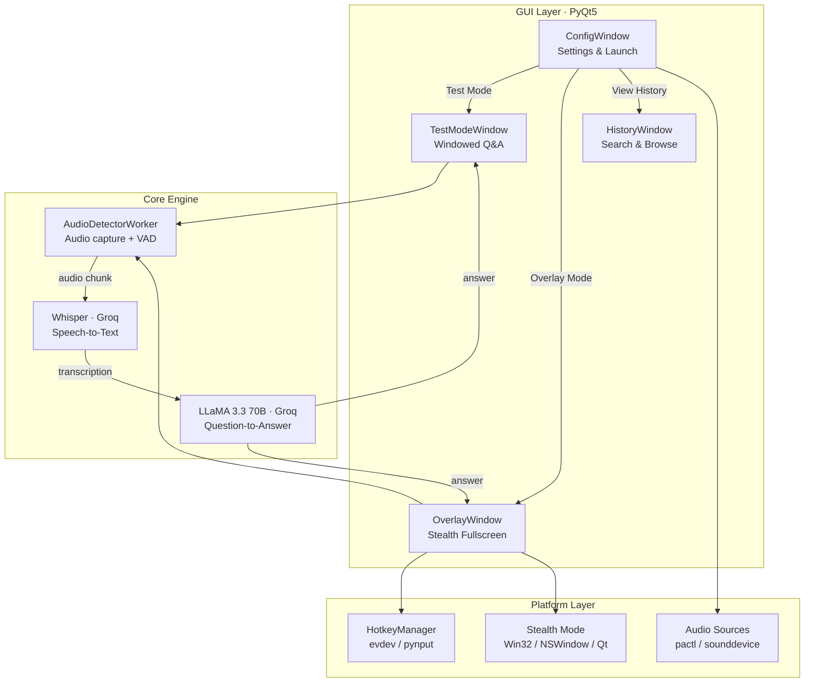

<p align="center">
  <h1 align="center">Audio Question Detector</h1>
  <p align="center">
    Real-time audio question detection with AI-powered answers.<br>
    Captures system audio, detects questions via Whisper, and generates instant answers using LLaMA 3.3.
  </p>
</p>

<p align="center">
  <a href="https://github.com/Alkaness/audio_question_detector/actions"></a>
  <a href="https://github.com/Alkaness/audio_question_detector/releases"></a>
  <a href="LICENSE"></a>
  
  
  
</p>

---

> **Disclaimer — Educational Use Only**
>
> This software is provided **strictly for educational and research purposes**. It is intended as a demonstration of real-time audio processing, speech recognition, and large language model integration. **Using this tool during actual interviews, exams, certifications, or any form of assessment is unethical and may violate terms of service, academic integrity policies, or applicable laws.** The authors assume no responsibility for misuse. By using this software, you agree to use it only in lawful and ethical contexts, such as personal learning, experimentation, and technical exploration.

---

## Features

- **Real-time audio capture** — system audio monitor or microphone input
- **WebRTC VAD** — ML-based voice activity detection with RMS fallback
- **AI-powered answers** — Groq Whisper transcription + LLaMA 3.3 70B generation
- **Stealth overlay** — transparent fullscreen overlay, invisible to screen capture on Windows and macOS
- **9 answer languages** — Ukrainian, English, Russian, German, French, Spanish, Polish, Chinese, Japanese
- **Topic context** — configurable domain for more relevant answers
- **Custom Whisper prompt** — keywords to improve transcription accuracy
- **Conversation memory** — maintains last 10 Q&A pairs for contextual follow-ups
- **Clipboard integration** — copy the last answer with a hotkey
- **Adjustable overlay font** — resize text on the fly
- **Searchable answer history** — JSON-backed history panel with full-text search
- **Persistent settings** — remembers preferences across restarts
- **Dark / Light themes** — Apple-inspired UI
- **Auto-update checker** — notifies of new GitHub releases

## Architecture



### File Structure

```
audio_detector_gui.py  — Main application (~1700 LOC, cross-platform)
modern_widgets.py      — Custom Qt widgets (ModernCard, ModernButton, ModernToggle, etc.)
styles.py              — Theme engine (color palette, stylesheets, palette management)
build.py               — PyInstaller build script (auto-detects platform)
launch.sh              — Linux / macOS launcher (auto-creates venv)
launch.bat             — Windows launcher
requirements.txt       — Dependencies (platform-conditional)
.env                   — Groq API key (not committed)
```

### Data Flow

1. **Audio capture** — `sounddevice` InputStream records in 100ms blocks
2. **VAD chunking** — WebRTC VAD (or RMS fallback) detects speech boundaries (2–15s chunks)
3. **Transcription** — Groq Whisper `large-v3` with configurable prompt and conversation context
4. **Question detection** — keyword matching and punctuation heuristics
5. **Answer generation** — Groq LLaMA 3.3 70B with conversation memory (last 10 pairs)
6. **Display** — Rich HTML rendering in overlay or test window

## Platform Support

| Feature | Linux | Windows | macOS |
|---------|-------|---------|-------|
| **Screen capture exclusion** | Not available | `SetWindowDisplayAffinity` | `NSWindow.sharingType` |
| **Audio sources** | PulseAudio (`pactl`) | `sounddevice` (WASAPI) | `sounddevice` (CoreAudio) |
| **Global hotkeys** | `evdev` (raw input) | `pynput` | `pynput` |
| **Standalone build** | `dist/AudioQuestionDetector` | `dist/AudioQuestionDetector.exe` | `dist/AudioQuestionDetector.app` |

## Quick Start

### Prerequisites

- **Python 3.9+**
- **Groq API key** — [Get one](https://console.groq.com/keys)

### Installation

```bash
git clone https://github.com/Alkaness/audio_question_detector.git
cd audio_question_detector

# Create .env
echo "GROQ_API_KEY=your_key_here" > .env

# Setup virtual environment
python3 -m venv .venv
source .venv/bin/activate        # Linux / macOS
# .venv\Scripts\activate         # Windows
pip install -r requirements.txt

# Run
python3 audio_detector_gui.py
```

Or use the launcher script:
```bash
./launch.sh     # Linux / macOS (auto-creates venv)
launch.bat      # Windows
```

### Platform-Specific Setup

<details>
<summary><b>Linux</b></summary>

```bash
sudo apt-get install python3-pyqt5 pulseaudio-utils
sudo usermod -aG input $USER   # Required for global hotkeys
# Log out and back in for group changes to take effect
```
</details>

<details>
<summary><b>Windows</b></summary>

To capture system audio, enable **Stereo Mix**:
1. Right-click speaker icon → Sound settings → Recording tab
2. Right-click → Show Disabled Devices → Enable Stereo Mix

If unavailable, install [VB-Audio Virtual Cable](https://vb-audio.com/Cable/).
</details>

<details>
<summary><b>macOS</b></summary>

- Requires **macOS 12+ (Monterey)** for screen capture exclusion
- Grant **Accessibility** and **Screen Recording** permissions when prompted
- For system audio capture, install [BlackHole](https://github.com/ExistentialAudio/BlackHole)
</details>

## Configuration

| Option | Description |
|--------|-------------|
| **Audio Source** | System audio monitor or microphone |
| **Mode** | Test Mode (windowed) or Overlay Mode (transparent fullscreen) |
| **Language** | Answer language — 9 options |
| **Topic** | Context topic for better answers (e.g. "React interview", "System design") |
| **Whisper Prompt** | Keywords to improve transcription accuracy |
| **Theme** | Dark / Light mode toggle |
| **Overlay Area** | Custom screen region for the overlay |

## Overlay Hotkeys

All hotkeys require **double-press** within 400ms:

| Key | Action |
|-----|--------|
| `F1` ×2 | Hide overlay (go silent) |
| `F2` ×2 | Restore overlay |
| `F3` ×2 | Quit application |
| `F4` ×2 | Copy last answer to clipboard |
| `F9` ×2 | Increase font size |
| `F10` ×2 | Decrease font size |
| `Escape` | Close overlay, return to Settings |

## Screen Sharing Privacy

| Platform | Method | Result |
|----------|--------|--------|
| **Windows** | `SetWindowDisplayAffinity(WDA_EXCLUDEFROMCAPTURE)` | Overlay invisible to all capture tools |
| **macOS 12+** | `NSWindow.sharingType = .none` | Overlay invisible to screenshots, recording, AirPlay |
| **Linux** | No API available | Share a specific window (not full screen) as workaround |

## Building Standalone Executable

```bash
pip install pyinstaller
python build.py
```

Output:
- **Linux**: `dist/AudioQuestionDetector`
- **Windows**: `dist/AudioQuestionDetector.exe`
- **macOS**: `dist/AudioQuestionDetector.app`

## Answer History

All Q&A pairs are saved automatically to `~/.audio_detector_history.json`.

Access via **View History** in Settings:
- Full-text search across questions and answers
- Clear all history
- Timestamps, language, and topic metadata per entry

## Contributing

1. Fork the repository
2. Create your feature branch (`git checkout -b feature/my-feature`)
3. Commit your changes (`git commit -m 'Add my feature'`)
4. Push to the branch (`git push origin feature/my-feature`)
5. Open a Pull Request

## Terms of Use

This project is released for **educational and research purposes only**. It serves as a technical demonstration of:

- Real-time audio stream processing with Python
- Voice activity detection (WebRTC VAD)
- Speech-to-text via the Groq Whisper API
- Large language model integration (LLaMA 3.3)
- Cross-platform desktop application development with PyQt5
- Stealth window management on Windows, macOS, and Linux

**You must not use this software to gain an unfair advantage in any interview, examination, certification, academic assessment, or competitive setting.** Doing so may violate the policies of the administering organization, academic integrity codes, employment agreements, or applicable laws. The authors disclaim all liability for any consequences resulting from misuse.

## License

This project is licensed under the MIT License — see the [LICENSE](LICENSE) file for details.

---

<p align="center">
  Built with <a href="https://groq.com">Groq</a> · <a href="https://www.python.org">Python</a> · <a href="https://riverbankcomputing.com/software/pyqt/">PyQt5</a>
</p>
